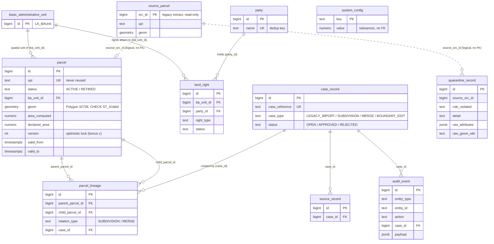

# DATA-MODEL.md — ERD and load timings

## ERD

Notes:
- `public_parcel_view` (not shown) is a view over `parcel` with `status='ACTIVE'` and no `ba_unit_id`, holder or bookkeeping columns, so holder identity is unreachable from the public API by construction.
- `system_config` and `schema_migrations` have no relationships.
- LADM mapping of each table is in `ARCHITECTURE.md`; index justifications are in `README.md`.

## Load timings

`npm run load` (`api/src/scripts/load.ts`): 301,600 source rows → 301,140 parcels + 460 quarantined, one transaction. Three fresh runs on a scratch database (each dropped and re-seeded), same machine and Postgres as `PERFORMANCE.md` (Windows 11, Docker Desktop/WSL2, Postgres 16.4 / PostGIS 3.4, default settings), run from the host over TCP.

| Stage | Run 1 | Run 2 | Run 3 |
|---|---|---|---|
| setup (case + source record) | 21 ms | 27 ms | 27 ms |
| classify + quarantine | 1,564 ms | 1,496 ms | 1,482 ms |
| build final load set | 286 ms | 289 ms | 271 ms |
| insert `basic_administrative_unit` | 582 ms | 455 ms | 480 ms |
| insert `parcel` (incl. GiST + btree maintenance) | 8,060 ms | 7,728 ms | 7,022 ms |
| insert `party` (dedup by name) | 144 ms | 138 ms | 139 ms |
| insert `land_right` | 3,468 ms | 3,375 ms | 3,084 ms |
| audit + case close + commit | 25 ms | 27 ms | 24 ms |
| **Total** | **14,150 ms** | **13,535 ms** | **12,529 ms** |

**Median 13.5 s (range 12.5–14.2 s).** Seeding the source table (`db/init/001_seed.sql`) is separate and took ~1.8–2.0 s.

Where the time goes: `parcel` is 56–57% of the load because every row also maintains the GiST index on `geom`, the primary key and four other btrees (`upi` unique, `status`, admin unit, `ba_unit_id`); `land_right` (~25%) is a join to `party` plus its primary key, two btrees and FK checks. Classification and quarantine is ~11%. A production-scale load (11.7M rows) would drop the secondary indexes before the bulk insert and rebuild them after, and would load per district in batches instead of one transaction; not done here because 13 s doesn't justify the added complexity.
